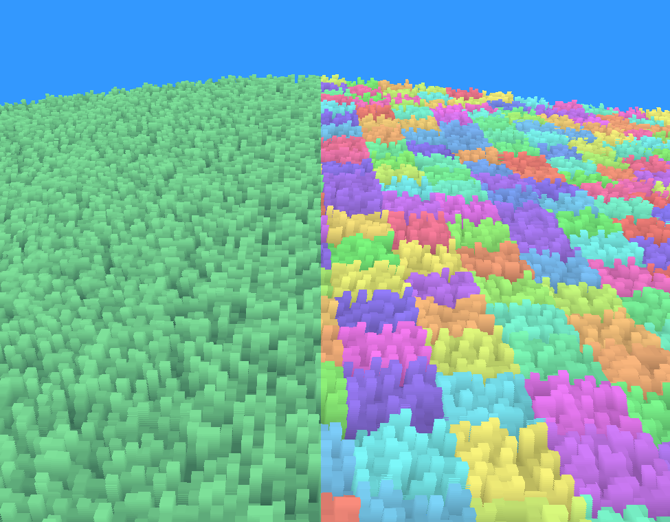

# Rendering-Experiments
Contains some experiments I wanted to share, because I thought they were cool. Use them if you want :]  
But you can also look at my <a href="https://www.youtube.com/@Ein_Baum">youtube channel</a>, where I sometimes upload videos of render stuff.

## Grass Shader 

A shader that is able to render grass based on stacks of quads. I like the blocky style, but the strands could also be rounded off with a bit of math.  
The left side shows how the grass looks if it is properly colored, while the right shows single instances (every instance has a different color). 
The grass is created, by discarding fragments in higher quad layers, by testing, if a random value based on a strand location is higher or lower than the current quad layer. The amount of single grass strands could be tweeked however one likes. It could be one, it could be one thousand. I set it to 10 in the example (line 38 in grassFrag.glsl). 
Viewproj is just the view matrix premultiplied with the projection matrix, and I am sorry for the wind displacement math :]  

### YouTube Demo
<iframe width="560" height="315" src="https://www.youtube.com/embed/XnnvZ8KpKrs?si=Is6y8GmZIgscb4o0" title="YouTube video player" frameborder="0" allow="accelerometer; autoplay; clipboard-write; encrypted-media; gyroscope; picture-in-picture; web-share" referrerpolicy="strict-origin-when-cross-origin" allowfullscreen></iframe>
---